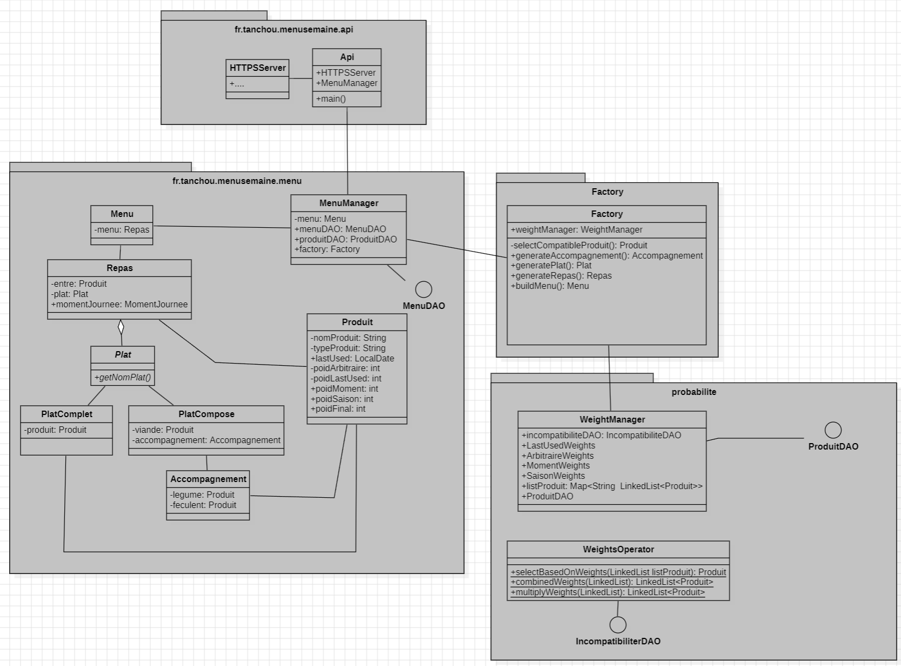

# MenuD-laSemaine
Projet-Personnel

Ce project consiste à résoudre un problem de gestion de menu de la semaine pour une famille.

le projet est divisé en 4 parties :
- La partie qui gere les menus, les plats, les alliments et les recettes
- La partie qui gere l'api
- La partie qui gere la base de données
- La partie qui gere l'interface graphique (WEB)

## [Plats](info/menu/README.md)

## [Base de données](info/db/README.md)

## [API](info/api/README.md)

## [Interface Graphique](info/interface/README.md)

