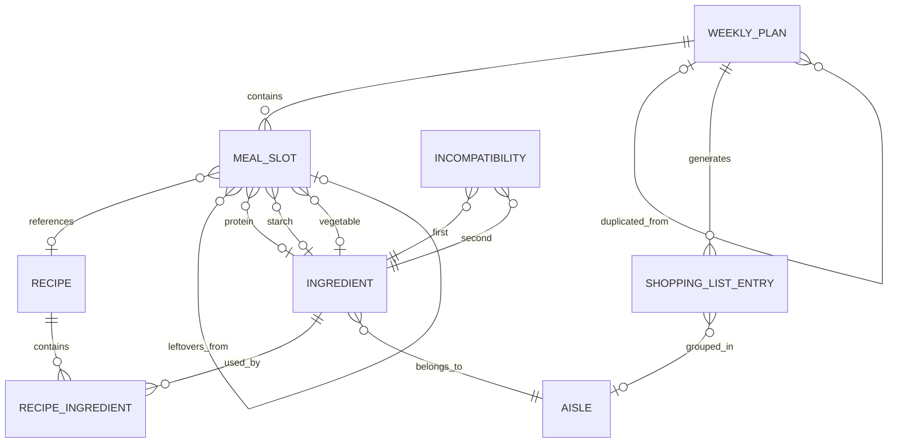

# Plan d’implémentation — MenuD-laSemaine V2

> Statut : MVP V2 implémenté et validé localement le 15 août 2026
> Public cible : une famille non informaticienne
> Plateforme principale : application web responsive, conçue mobile-first
> Langue et calendrier : français, semaine du lundi au dimanche, fuseau Europe/Paris

---

## 1. Vision du produit

MenuD-laSemaine doit permettre à une famille de préparer un menu cohérent en quelques minutes, sans comprendre le fonctionnement du moteur ni saisir de coefficients techniques.

L’application doit aider la famille à :

- générer les repas de la semaine ;
- éviter les répétitions et les associations incohérentes ;
- adapter les repas à la saison et au moment de la semaine ;
- remplacer facilement une proposition qui ne convient pas ;
- conserver l’historique des semaines réellement utilisées ;
- calculer une liste de courses adaptée au nombre de personnes ;
- réutiliser une semaine appréciée.

### Principes produit

1. **Aucun jargon technique dans l’interface.** Les scores, signatures et coefficients restent internes.
2. **Une action principale par écran.** L’utilisateur doit toujours comprendre quoi faire ensuite.
3. **Des valeurs par défaut utiles.** La famille ne doit pas remplir 14 formulaires chaque semaine.
4. **Les contraintes importantes ne sont jamais contournées silencieusement.**
5. **Toute action risquée est réversible ou confirmée.**
6. **Le mobile est l’expérience de référence.** Le bureau apporte plus d’espace, pas des fonctions indispensables supplémentaires.

### Périmètre familial retenu

La V2 est conçue pour **un foyer unique** partageant les mêmes menus, préférences et données. Elle n’est pas pensée comme une plateforme SaaS multi-familles.

Si l’application est accessible depuis Internet, elle doit néanmoins être protégée par une authentification simple adaptée à la famille : compte partagé, lien magique ou protection équivalente. Le choix exact sera arrêté avant le déploiement.

---

## 2. Diagnostic du système existant

### Fonctionnement actuel

Le moteur Java calcule un poids multiplicatif pour chaque produit :

```text
poidsFinal = poidsMoment × poidsSaison × poidsArbitraire × poidsLastUsed
```

Les moments et les saisons sont représentés par huit nombres saisis manuellement.

### Problèmes confirmés

| Problème | Conséquence |
|---|---|
| La génération consulte le menu enregistré, pas celui en cours de construction | Répétitions possibles dans une même semaine |
| Viande, légume et féculent sont tirés séparément | Associations peu cohérentes |
| Les incompatibilités ne sont pas vérifiées sur tous les composants du repas | Une protéine peut être incohérente avec son accompagnement |
| Onze nombres sont nécessaires pour ajouter un produit | Saisie difficile et arbitraire |
| La table `Menu` est supprimée puis recréée | Aucun historique fiable |
| La date de dernière utilisation est portée par l’ingrédient | Impossible de distinguer un ingrédient d’un plat exact |
| Le samedi est traité comme un jour de semaine dans la boucle actuelle | Pondérations de week-end incorrectes |
| Le hasard n’est pas injectable | Générations et tests impossibles à reproduire |
| Il n’existe pas de suite de tests automatisés | Régressions difficiles à détecter |

### Décisions de refonte

- Réécriture en TypeScript plutôt qu’évolution du modèle Java existant.
- Conservation des données utiles grâce à un script de migration contrôlé.
- Remplacement des poids techniques par des choix compréhensibles.
- Historisation des semaines et séparation entre brouillon et semaine confirmée.
- Unification des recettes et des plats composés dans le moteur sous la notion de `MealCandidate`.

### Changements fonctionnels à assumer explicitement

- Les anciennes **entrées** ne font pas partie du MVP V2. Elles pourront revenir plus tard comme option de repas.
- Un plat composé contient une protéine et au moins un accompagnement : féculent, légume ou les deux. Cette règle permet des repas plus simples sans imposer trois composants.
- Un repas libre peut être enregistré avec un libellé, mais il ne contribue à la liste de courses que si ses ingrédients sont renseignés.

---

## 3. Expérience utilisateur mobile-first

### 3.1. Navigation principale

Sur mobile, une barre fixe en bas comporte quatre destinations :

1. **Semaine** — consulter et préparer les repas ;
2. **Courses** — cocher la liste dans le magasin ;
3. **Recettes** — rechercher, ajouter et modifier recettes et ingrédients ;
4. **Plus** — historique, favoris et réglages.

Sur écran large, ces destinations peuvent être présentées dans une barre latérale ou une barre supérieure. Les libellés restent visibles : une icône seule ne doit pas porter une action importante.

### 3.2. Écran « Semaine »

#### Mobile

La semaine est affichée sous forme de cartes verticales par jour, et non comme une grille de quatorze petites cases.

Chaque carte contient :

- le jour et la date ;
- le déjeuner ;
- le dîner ;
- le nombre de personnes uniquement s’il diffère de la valeur habituelle ;
- un badge discret si le repas est verrouillé, libre, prévu à l’extérieur ou composé de restes.

L’application ouvre automatiquement la semaine courante et positionne le jour actuel près du haut de l’écran.

Une action principale reste accessible : **« Préparer ma semaine »** quand elle est vide, puis **« Régénérer les repas libres »** quand elle contient déjà des choix.

#### Écran large

La même information peut devenir une grille de sept jours sur deux lignes ou deux colonnes, sans changer les règles ni les actions disponibles.

### 3.3. Actions sur un repas

Un appui sur un repas ouvre une feuille d’actions mobile lisible :

- **Voir le détail** ;
- **Remplacer ce repas** ;
- **Choisir moi-même** ;
- **Garder ce repas** / **Autoriser le remplacement** ;
- **Prévoir des restes** ;
- **Repas à l’extérieur** ;
- **Modifier le nombre de personnes**.

Les actions fréquentes ont un libellé, pas seulement un pictogramme. Les zones tactiles mesurent au moins 44 × 44 px. Aucun geste caché, comme un swipe, n’est obligatoire.

Après une modification, une notification courte propose **« Annuler »**. Une confirmation explicite est demandée avant d’effacer ou de remplacer plusieurs repas.

### 3.4. Génération guidée

Le premier usage suit un assistant court :

1. nombre habituel de personnes ;
2. moments où la famille mange à la maison ;
3. aliments ou contraintes à exclure ;
4. ajout de quelques favoris ou chargement des exemples proposés ;
5. génération de la première semaine.

Les réglages avancés — saisons, moments, familles et incompatibilités — utilisent une divulgation progressive. Ils ne bloquent pas l’ajout rapide d’un ingrédient ou d’une recette.

### 3.5. Remplacement d’un repas

L’écran de remplacement affiche trois grandes propositions comprenant :

- le nom du repas ;
- une courte description ;
- le temps total si connu ;
- les raisons utiles, exprimées simplement : « de saison », « pas mangé récemment », « rapide ce midi ».

Les scores numériques ne sont jamais affichés.

L’utilisateur choisit une proposition ou appuie sur **« Voir trois autres idées »**. Les propositions déjà refusées ne reviennent pas pendant la même session.

### 3.6. Liste de courses sur mobile

La liste de courses est regroupée par rayon et optimisée pour être cochée d’une main :

- grandes cases à cocher ;
- état conservé après fermeture de la page ;
- quantité totale lisible ;
- possibilité de masquer les articles cochés ;
- ajout manuel rapide ;
- indication du ou des repas à l’origine d’un article ;
- bouton « Tout décocher » protégé par une confirmation.

La gestion détaillée du stock du placard n’est pas incluse dans le MVP.

### 3.7. Accessibilité et qualité perçue

- Contraste conforme au minimum WCAG AA.
- Navigation utilisable au clavier sur ordinateur.
- Libellés associés aux champs et états annoncés aux lecteurs d’écran.
- La couleur n’est jamais le seul moyen de comprendre un état.
- Aucun écran principal ne dépend du survol de la souris.
- États de chargement explicites et écrans vides accompagnés d’une action claire.
- Formulaires courts, erreurs placées près du champ et données conservées après une erreur.
- Interface en français naturel et dates au format local.

Une installation en tant que PWA pourra être ajoutée après le MVP. Le fonctionnement hors connexion complet n’est pas une exigence initiale.

---

## 4. Concepts métier

### 4.1. Semaine et confirmation

Une semaine possède un statut :

- `draft` — génération et modifications libres ;
- `confirmed` — semaine retenue par la famille et prise en compte dans l’historique ;
- `archived` — ancienne semaine conservée en lecture seule.

**Seuls les repas d’une semaine confirmée alimentent le refroidissement et les statistiques d’utilisation.** Générer, remplacer ou abandonner un brouillon ne signifie pas que le repas a été consommé.

Une semaine confirmée est en lecture seule, à l’exception de son statut de favori. Une correction exceptionnelle doit passer par une action explicite afin de ne pas modifier l’historique sans avertissement.

### 4.2. Types de créneaux

| Type | Description |
|---|---|
| `composed` | Protéine avec féculent et/ou légume |
| `recipe` | Recette complète |
| `leftovers` | Restes provenant d’un autre créneau |
| `eating_out` | Restaurant, invitation ou repas hors domicile |
| `custom` | Choix libre saisi par la famille |
| `empty` | Créneau volontairement non planifié |

Un créneau `leftovers` référence si possible le repas source. Il n’ajoute pas une deuxième fois les mêmes quantités à la liste de courses.

### 4.3. Saisons

| Saison | Mois |
|---|---|
| `winter` | décembre, janvier, février |
| `spring` | mars, avril, mai |
| `summer` | juin, juillet, août |
| `autumn` | septembre, octobre, novembre |

L’interface affiche les noms français. En base et dans le code, les valeurs internes restent stables et sans accents.

Cocher les quatre saisons signifie « toute l’année ». Une liste de saisons vide est invalide afin d’éviter un aliment impossible à utiliser.

La saison est calculée d’après la date réelle du créneau, pas d’après la date du serveur au moment de la génération.

### 4.4. Moments autorisés

Chaque ingrédient et chaque recette propose quatre choix simples, cochés par défaut :

- déjeuner en semaine ;
- dîner en semaine ;
- déjeuner le week-end ;
- dîner le week-end.

Le samedi et le dimanche sont tous les deux considérés comme week-end.

### 4.5. Appréciation

La famille attribue une note de 1 à 5 :

| Note | Signification dans l’interface |
|---:|---|
| 1 | On préfère éviter |
| 2 | De temps en temps |
| 3 | On aime bien |
| 4 | On aime beaucoup |
| 5 | Un de nos favoris |

Pour une recette, la note de la recette est utilisée. Pour un plat composé, le moteur utilise la moyenne géométrique des notes des composants présents. Cette formule conserve une échelle de 1 à 5 tout en évitant qu’un ingrédient très peu apprécié soit totalement masqué par deux favoris.

Les coefficients devront être validés par simulation ; la valeur 5 n’est pas considérée a priori comme « modérée » simplement parce qu’elle est cinq fois supérieure à 1.

### 4.6. Contraintes alimentaires

Une contrainte de sécurité ou un choix alimentaire ferme — allergie, ingrédient exclu, régime du foyer — est un filtre dur et ne peut jamais être relâché automatiquement.

Le MVP doit au minimum permettre de désactiver un ingrédient pour toute la famille. Un système complet de profils individuels et d’allergènes structurés pourra être ajouté ensuite si le besoin est confirmé.

---

## 5. Représentation unifiée d’un candidat-repas

Le moteur ne score pas directement les entités Prisma. Les services convertissent recettes et plats composés vers un type métier commun :

```typescript
type MealCandidate = {
  kind: 'recipe' | 'composed';

  // Identité stable du plat exact.
  signature: string;
  recipeId?: string;
  proteinId?: string;
  starchId?: string;
  vegetableId?: string;
  ingredientIds: string[];

  // Traits communs utilisés par les règles de variété.
  proteinFamily?: string;
  starchFamily?: string;
  style?: string;

  rating: number; // 1..5
  seasons: Season[];
  allowedMoments: AllowedMoments;
};
```

### Signature exacte

- Recette : `recipe:<recipeId>`
- Plat composé : `composed:<proteinId>:<starchId-or-none>:<vegetableId-or-none>`

Cette signature sert à :

- interdire le même plat exact deux fois dans une semaine ;
- rechercher sa dernière consommation ;
- comparer les alternatives ;
- rendre les tests déterministes.

Les traits d’une recette sont déduits de ses ingrédients et complétés par son style. Une recette au poulet participe donc bien au malus de la famille `poultry`.

---

## 6. Moteur de génération

### 6.1. Entrées et sorties

Le moteur est une bibliothèque TypeScript pure. Il ne connaît ni Prisma, ni HTTP, ni React.

Il reçoit :

- la semaine et les créneaux à remplir ;
- les créneaux verrouillés ou spéciaux ;
- les candidats normalisés ;
- les incompatibilités ;
- l’historique des repas confirmés antérieurs à chaque date cible ;
- les réglages de génération ;
- une source aléatoire injectable et, en test, une seed.

Il retourne un résultat explicite :

```typescript
type GenerationResult = {
  slots: GeneratedSlot[];
  warnings: GenerationWarning[];
  seed: string;
  complete: boolean;
};
```

### 6.2. Contexte de génération

```typescript
type GenerationContext = {
  planStartDate: string;
  assignedSlots: Map<number, AssignedMeal>;
  consumedHistory: ConsumedMeal[];
  rejectedSignatures: Set<string>;
};
```

La distance entre deux repas est la différence absolue de leurs index de créneau. Ainsi, un créneau verrouillé situé plus tard dans la semaine influence aussi la génération d’un créneau antérieur.

### 6.3. Filtres durs

Un candidat est exclu si :

1. il contient un ingrédient désactivé ou interdit ;
2. sa saison n’autorise pas la date du créneau ;
3. son moment n’est pas autorisé ;
4. sa signature exacte existe déjà dans la semaine ;
5. deux de ses ingrédients sont incompatibles ;
6. il fait partie des propositions refusées pendant le swap courant.

Pour un plat composé, la vérification du doublon et des incompatibilités est effectuée **après construction du candidat complet**, pas pendant la sélection isolée d’un ingrédient.

Les incompatibilités sont symétriques et vérifiées sur toutes les paires d’ingrédients du candidat.

### 6.4. Refroidissement fondé sur l’historique

Le cooling porte sur la signature exacte du plat et est calculé à partir du dernier créneau confirmé antérieur à la date cible.

```text
Jamais consommé       → 1.00
0 à 6 jours           → 0.00
7 à 9 jours           → 0.15
10 à 13 jours         → 0.40
14 à 20 jours         → 0.70
21 à 27 jours         → 0.90
28 jours ou plus      → 1.00
```

Le doublon dans la semaine courante reste un filtre dur distinct. Le moteur ne stocke pas de `lastUsedDate` mutable sur l’ingrédient : l’information est dérivée des repas confirmés.

Une évolution ultérieure pourra ajouter un malus intersemaine plus léger par famille de protéine. Elle ne fait pas partie de la première version du moteur.

### 6.5. Variété dans la semaine

Pour chaque dimension, seule la répétition assignée la plus proche est utilisée :

| Répétition | Distance | Facteur |
|---|---:|---:|
| Même famille de protéine | 1 repas | 0.05 |
| Même famille de protéine | 2 à 3 repas | 0.30 |
| Même famille de protéine | 4 repas ou plus | 0.70 |
| Même famille de féculent | 1 repas | 0.10 |
| Même famille de féculent | 2 à 3 repas | 0.40 |
| Même style | 1 à 2 repas | 0.20 |

Les facteurs applicables aux dimensions différentes sont multipliés, avec un plancher global de `0.05`. Une répétition reste donc possible, mais peu probable.

Ces valeurs sont des paramètres internes centralisés, pas des constantes dispersées dans le code ni des réglages présentés à la famille.

### 6.6. Score

```text
score = W_appreciation × W_cooling × W_variety
```

Un score à zéro rend le candidat non sélectionnable pour ce niveau de génération. Tous les calculs utilisent des nombres décimaux ; aucun arrondi intermédiaire n’est effectué.

### 6.7. Recette ou plat composé

Le moteur choisit d’abord un type parmi ceux qui possèdent au moins un candidat valide :

| Créneau | Probabilité initiale d’une recette |
|---|---:|
| Déjeuner en semaine | 25 % |
| Dîner en semaine | 40 % |
| Week-end | 55 % |

Une correction souple vise une semaine équilibrée, sans prétendre éviter les séries uniquement grâce à un ratio. Les repas spéciaux sont exclus de ce calcul.

Si le type tiré ne possède finalement aucun candidat avec un score positif, l’autre type est essayé avant d’appliquer le fallback.

### 6.8. Ordre, tentatives et blocages

Pour limiter le biais d’un parcours strict du lundi au dimanche :

1. les créneaux verrouillés sont chargés dans le contexte ;
2. les créneaux libres les plus contraints sont générés en premier ;
3. à contrainte égale, l’ordre chronologique est utilisé ;
4. plusieurs tentatives complètes sont possibles avec des seeds différentes ;
5. le moteur retient aléatoirement l’une des meilleures semaines valides, plutôt que toujours l’optimum absolu.

Un backtracking borné peut revenir sur les derniers choix si un créneau devient impossible. La génération doit avoir une limite stricte de tentatives et ne jamais boucler indéfiniment.

### 6.9. Politique de fallback

Ordre de relâchement :

1. nouvelle tentative pondérée ;
2. réduction des malus de variété ;
3. neutralisation du cooling historique ;
4. essai de l’autre type de repas ;
5. créneau laissé « à choisir » avec une explication simple.

Ne sont jamais relâchés automatiquement :

- ingrédients interdits ou désactivés ;
- incompatibilités ;
- cohérence des données ;
- doublon exact dans la semaine.

Une contrainte de saison ou de moment ne peut être contournée qu’après une action manuelle explicite de l’utilisateur.

### 6.10. Swap d’un créneau

Pour remplacer un repas :

1. construire le contexte avec les treize autres créneaux ;
2. exclure la signature actuelle et les propositions déjà refusées ;
3. filtrer et scorer les candidats complets ;
4. tirer trois alternatives pondérées **sans remise** ;
5. retourner les raisons utiles à afficher, jamais les scores bruts.

Le bouton « Voir trois autres idées » ajoute les propositions précédentes à `rejectedSignatures` et recommence.

### 6.11. Réapplication d’une semaine favorite

- Création d’un nouveau brouillon lié par `duplicatedFromId`.
- Copie des quatorze créneaux et de leur snapshot.
- Vérification des ingrédients désactivés, de la saison et des moments.
- Présentation des conflits avant remplacement.
- Cooling ignoré pendant la copie, car il s’agit d’un choix explicite.
- Les repas conflictuels peuvent être conservés manuellement ou remplacés.

---

## 7. Modèle de données cible

Le schéma ci-dessous est conceptuel. `schema.prisma` devra ajouter les noms de relations, index et politiques de suppression exactes.



### `WeeklyPlan`

| Champ | Règle |
|---|---|
| `id` | UUID ou CUID, clé primaire |
| `startDate` | Date du lundi, unique, source de vérité |
| `status` | `draft`, `confirmed`, `archived` |
| `isFavorite` | Faux par défaut |
| `duplicatedFromId` | Auto-référence nullable |
| `createdAt`, `updatedAt` | Audit technique |
| `confirmedAt` | Nullable, renseigné à la confirmation |

L’année et le numéro de semaine ISO sont dérivés de `startDate`, pas stockés comme deuxième source de vérité.

### `MealSlot`

| Champ | Règle |
|---|---|
| `id` | Clé primaire |
| `weeklyPlanId` | Clé étrangère obligatoire |
| `mealDate` | Date réelle du repas |
| `mealTime` | `lunch` ou `dinner` |
| `guestCount` | Entier strictement positif |
| `isLocked` | Faux par défaut |
| `slotType` | Type décrit précédemment |
| `customLabel` | Nullable |
| `recipeId` | Nullable |
| `proteinId`, `starchId`, `vegetableId` | Nullables |
| `leftoversFromSlotId` | Nullable |
| `mealSignature` | Nullable pour les créneaux non alimentaires |
| `mealSnapshot` | JSON contenant le nom, les traits et les quantités au moment du choix |

Contraintes :

- unicité de `(weeklyPlanId, mealDate, mealTime)` ;
- cohérence des champs selon `slotType` ;
- un repas composé possède une protéine et au moins un accompagnement, sauf choix manuel explicitement autorisé ;
- une recette possède `recipeId` ;
- les restes possèdent si possible `leftoversFromSlotId`.

Les contraintes polymorphes non exprimables directement par Prisma seront ajoutées par SQL dans la migration PostgreSQL et doublées par une validation applicative.

### `Ingredient`

| Champ | Règle |
|---|---|
| `id`, `name` | Identité et nom unique normalisé |
| `category` | `protein`, `starch`, `vegetable`, `grocery`, `dairy`, `other` |
| `subFamily` | Famille utile à la variété |
| `rating` | Entier de 1 à 5 |
| `isActive` | Permet l’archivage sans casser l’historique |
| `aisleId` | Rayon nullable |
| `portionPerPerson` | Décimal positif nullable |
| `unit` | Unité normalisée nullable |
| quatre moments autorisés | Cochés par défaut |
| saisons | Au moins une saison |
| `createdAt`, `updatedAt` | Audit |

Il n’existe pas de `lastUsedDate` ou `usageCount` stocké comme source de vérité. Ces valeurs sont calculées depuis les créneaux confirmés et pourront être mises en cache plus tard si nécessaire.

### `Recipe`

| Champ | Règle |
|---|---|
| `id`, `name` | Identité et nom |
| `style` | Nullable |
| `rating` | 1 à 5 |
| `prepTimeMinutes`, `cookTimeMinutes` | Entiers positifs nullables |
| `basePortions` | Entier positif |
| `isActive` | Archivage logique |
| moments et saisons | Mêmes règles que les ingrédients |
| `createdAt`, `updatedAt` | Audit |

### `RecipeIngredient`

- unicité de `(recipeId, ingredientId)` ;
- quantité décimale positive ;
- unité explicite ;
- quantité définie pour `basePortions` ;
- conversion limitée aux unités compatibles (`g`/`kg`, `ml`/`cl`/`l`).

Les unités `piece`, `slice`, `can` et équivalentes ne sont pas converties automatiquement sans règle explicite.

### `Incompatibility`

Une paire est stockée dans un ordre canonique afin que `(A, B)` et `(B, A)` désignent la même incompatibilité.

Contraintes :

- unicité de `(ingredientId1, ingredientId2)` ;
- `ingredientId1 != ingredientId2` ;
- suppression d’un ingrédient actif interdite : on utilise `isActive`.

### `Aisle`, `AppSettings` et liste de courses

`Aisle` contient un nom et un ordre d’affichage.

`AppSettings` est une configuration unique du foyer avec notamment :

- nombres de personnes habituels par moment ;
- fuseau horaire ;
- premier jour de semaine ;
- paramètres d’onboarding terminés ou non.

Les articles cochés et les ajouts manuels de la liste de courses sont persistés par semaine afin que plusieurs membres puissent retrouver le même état.

`ShoppingListEntry` matérialise cet état avec :

- `weeklyPlanId` ;
- une clé stable d’agrégation ;
- le libellé, la quantité, l’unité et le rayon ;
- `isChecked` et `isManual` ;
- les identifiants des créneaux sources.

Après modification d’un menu, la liste est recalculée dans une transaction. Une entrée générée qui conserve la même clé garde son état coché ; les ajouts manuels ne sont pas effacés. Les quantités sont toujours calculées depuis les snapshots des repas du plan concerné.

### 7.1. Snapshot historique

`mealSnapshot` protège l’historique contre les modifications ultérieures d’une recette ou d’un ingrédient. Il contient au minimum :

- nom affiché ;
- type et signature ;
- ingrédients, rôles, quantités et unités ;
- familles et style nécessaires à la génération ;
- version de format du snapshot.

Les relations vers les entités courantes servent à l’édition ; le snapshot sert à restituer le passé, réappliquer un favori et expliquer une ancienne liste de courses.

---

## 8. Architecture technique

### Stack

| Élément | Choix |
|---|---|
| Application web | Next.js App Router, version stable validée au démarrage |
| Langage | TypeScript en mode strict |
| Base de données | PostgreSQL |
| ORM | Prisma avec migrations versionnées |
| Validation | Schémas partagés côté serveur et formulaires |
| Styles | CSS maintenable avec variables de design et composants accessibles |
| Tests unitaires | Runner TypeScript compatible avec le projet |
| Tests navigateur | Playwright ou équivalent |
| Déploiement | Image Docker déployée sur Coolify |

Le passage à SQLite n’est pas présenté comme transparent. PostgreSQL est le moteur de référence ; un changement de fournisseur nécessiterait une validation des migrations et des fonctionnalités utilisées.

### Arborescence indicative

```text
prisma/
  schema.prisma
  migrations/
  seed.ts
  import-legacy.ts

src/
  app/
    page.tsx
    shopping-list/
    recipes/
    ingredients/
    history/
    favorites/
    settings/
    api/

  components/
    navigation/
    week/
    meal/
    forms/
    shopping-list/
    ui/

  engine/
    types.ts
    candidates.ts
    filters.ts
    cooling.ts
    variety.ts
    scorer.ts
    picker.ts
    generator.ts
    swap.ts

  services/
    generation.service.ts
    weekly-plan.service.ts
    history.service.ts
    shopping-list.service.ts
    ingredient.service.ts
    recipe.service.ts

  lib/
    prisma.ts
    dates.ts
    units.ts
    validation.ts
```

### Règles de séparation

- `engine/` contient uniquement des fonctions métier pures.
- `services/` charge les données, ouvre les transactions, appelle le moteur et persiste le résultat.
- les routes et actions valident toutes les entrées côté serveur ;
- les composants ne connaissent pas les modèles Prisma ;
- dates et heures sont centralisées et testées avec le fuseau Europe/Paris ;
- le hasard est injecté, jamais créé directement au milieu d’une fonction métier.

### Transactions et concurrence

- Générer ou confirmer une semaine est transactionnel.
- Deux requêtes ne doivent pas écraser silencieusement la même semaine.
- Une génération répétée avec la même clé d’idempotence ne crée pas deux plans.
- Les erreurs de sauvegarde ne laissent pas quatorze créneaux partiellement écrits.

### Exploitation

Avant mise en production :

- secrets uniquement dans les variables d’environnement ;
- HTTPS et protection de l’accès ;
- migrations exécutées de manière contrôlée ;
- sauvegarde automatique de PostgreSQL ;
- procédure de restauration testée ;
- journaux sans données sensibles ;
- endpoint de santé pour Coolify.

---

## 9. Migration de l’ancien projet

La réécriture ne doit pas supprimer silencieusement les données existantes.

### 9.1. Préparation

1. Export complet de la base MariaDB actuelle.
2. Conservation de l’export en lecture seule.
3. Inventaire du nombre de produits, incompatibilités et lignes de menu.
4. Création d’un rapport de migration avant toute écriture en production.

### 9.2. Règles de transformation

| Ancienne donnée | Transformation proposée |
|---|---|
| Poids de saison supérieur à zéro | Saison autorisée |
| Poids de moment supérieur à zéro | Moment autorisé |
| `poidsArbitraire` | Conversion provisoire en note 1–5 par tranches, puis écran de vérification |
| `viande` | Catégorie `protein`, sous-famille à compléter si inconnue |
| `feculent`, `legume` | Catégories correspondantes |
| `platComplet` | Recette importée, marquée « ingrédients à compléter » |
| `entree` | Ingrédient archivé ou recette à revoir, non utilisé automatiquement dans le MVP |
| Incompatibilité | Paire canonique conservée |
| Menu courant | Brouillon importé pour une date choisie, avec avertissement si incomplet |

Une recette importée sans ingrédients peut apparaître dans le menu, mais elle est exclue de la liste de courses tant qu’elle n’a pas été complétée.

### 9.3. Exécution sûre

- Mode `dry-run` produisant les créations, avertissements et rejets.
- Import idempotent : relancer le script ne crée pas de doublons.
- Journal des identifiants ancien → nouveau.
- Vérification des comptes avant et après import.
- Validation manuelle d’un échantillon.
- Retour arrière possible en restaurant la sauvegarde, sans supprimer l’ancien projet avant validation de la V2.

---

## 10. Phases d’implémentation

### Phase 0 — Décisions et prototype UX

- Valider les règles métier encore ajustables avec des exemples de vraies semaines.
- Réaliser les wireframes mobiles des écrans Semaine, Remplacement, Courses et Ajout de recette.
- Tester les libellés avec une personne non technicienne.
- Valider la suppression des entrées dans le MVP et la règle des plats composés.
- Fixer la stratégie d’authentification du foyer.

**Sortie :** règles approuvées et parcours mobile sans ambiguïté.

### Phase 1 — Socle, données et migration

- Initialiser Next.js, TypeScript strict, Prisma et PostgreSQL.
- Écrire les migrations avec contraintes et index.
- Implémenter les dates, unités et validations communes.
- Créer le seed de démonstration.
- Écrire et tester l’import de l’ancien modèle en mode dry-run.
- Mettre en place la CI : formatage, typage et tests.

**Sortie :** base reproductible et anciennes données importables.

### Phase 2 — Moteur pur

- Construire les `MealCandidate` de recettes et de plats composés.
- Implémenter filtres, cooling, variété, score et tirage.
- Injecter RNG et seed.
- Implémenter les tentatives bornées et le fallback.
- Implémenter le swap sans remise.
- Ajouter les tests unitaires et par propriétés.

**Sortie :** moteur déterministe en test et indépendant de la base.

### Phase 3 — Première tranche utilisable mobile

- Onboarding minimal du foyer.
- Vue mobile de la semaine.
- Génération des créneaux libres.
- Détail, choix manuel, verrouillage, restes et repas extérieur.
- Modification du nombre de personnes.
- Confirmation d’une semaine.
- Historique en lecture seule.

**Sortie :** la famille peut réellement préparer et confirmer une semaine depuis un téléphone.

### Phase 4 — Données et liste de courses

- CRUD mobile des ingrédients et recettes.
- Archivage au lieu de suppression physique.
- Gestion des saisons, moments, familles et incompatibilités.
- Calcul des quantités par nombre de personnes.
- Agrégation et conversion des unités compatibles.
- Liste persistante et cochable par rayon.

**Sortie :** cycle menu → courses complet.

### Phase 5 — Remplacement, favoris et confort

- Interface des trois alternatives et « trois autres idées ».
- Explications simples des propositions.
- Semaines favorites et réapplication contrôlée.
- Recherche et filtres dans recettes et historique.
- États vides, annulations et finitions d’accessibilité.

### Phase 6 — Déploiement et extensions

- Image Docker et déploiement Coolify.
- Authentification choisie pour le foyer.
- Sauvegardes, restauration, santé et journaux.
- Tests sur téléphones réels.
- Flux iCal.
- Évaluation ultérieure d’une PWA et du mode hors connexion.

---

## 11. Stratégie de tests

### 11.1. Tests unitaires déterministes

- Mapping date → saison et semaine/week-end.
- Courbe de cooling sur toutes les limites, y compris 0 à 6 jours.
- Signature des recettes et plats composés.
- Incompatibilités symétriques et multi-ingrédients.
- Calcul de l’appréciation d’un plat composé.
- Pénalités de variété dans les deux directions autour d’un créneau.
- Filtres de saison, moment et ingrédient désactivé.
- Politique de fallback.
- Agrégation des quantités et conversion d’unités.
- Restes exclus d’un second calcul de courses.

### 11.2. Tests par propriétés

Sur de nombreuses seeds, **chaque résultat** doit respecter les invariants :

- aucune signature exacte deux fois dans la même semaine ;
- aucune incompatibilité ;
- aucun ingrédient interdit ;
- quatorze créneaux valides ou un avertissement explicite ;
- même seed + mêmes entrées = même résultat ;
- génération terminée dans une limite de tentatives connue.

L’absence de doublon n’est pas validée seulement par « 100 générations sans erreur » : elle est affirmée sur chaque résultat individuel.

### 11.3. Tests statistiques

Avec un jeu de données fixe et plusieurs milliers de générations :

- un candidat mieux noté doit être choisi plus souvent, dans une tolérance définie ;
- une répétition proche doit être moins fréquente qu’une répétition éloignée ;
- une famille ne doit pas dominer artificiellement lorsque les pools sont équilibrés ;
- la même protéine doit rester possible dans deux plats différents.

Ces tests utilisent des intervalles de tolérance et une seed de campagne enregistrée afin d’éviter les tests aléatoires instables.

### 11.4. Tests d’intégration

- Génération et sauvegarde atomiques d’une semaine.
- Confirmation puis prise en compte dans le cooling.
- Brouillon abandonné non pris en compte dans le cooling.
- Modification concurrente détectée.
- Réapplication hiver → été avec conflits signalés.
- Recette modifiée sans altération du snapshot historique.
- Import legacy exécuté deux fois sans doublons.
- Liste de courses cohérente avec recettes, portions, repas libres et restes.

### 11.5. Tests navigateur et mobile

- Onboarding → génération → remplacement → confirmation.
- Ajout rapide d’une recette depuis un téléphone.
- Liste cochée puis page rechargée sans perte d’état.
- Navigation à 320 px de largeur et sur les tailles de téléphone courantes.
- Utilisation au clavier et avec un lecteur d’écran sur les parcours essentiels.
- Zones tactiles, contrastes et absence d’actions dépendantes du hover.
- Test manuel avec au moins une personne non informaticienne avant validation du MVP.

---

## 12. Critères d’acceptation du MVP

Le MVP est terminé lorsque :

- une personne non technicienne peut préparer une semaine depuis son téléphone sans documentation ;
- elle peut comprendre, modifier, verrouiller et confirmer chaque repas ;
- une régénération conserve les créneaux verrouillés ;
- les contraintes dures sont toujours respectées ;
- aucun plat exact n’est dupliqué dans la même semaine ;
- seul un menu confirmé influence l’historique ;
- les recettes contribuent aux mêmes règles de variété que les plats composés ;
- la liste de courses est correcte pour le nombre de personnes et reste cochée après rechargement ;
- les données historiques ne changent pas lorsqu’une recette est modifiée ;
- l’ancien jeu de données peut être importé avec un rapport contrôlable ;
- les tests automatisés, le typage et les migrations passent en CI ;
- la base est sauvegardée et une restauration a été testée avant utilisation réelle.

### Hors périmètre initial

- profils alimentaires individuels complexes ;
- gestion exhaustive du stock et des dates de péremption ;
- comparaison automatique des prix entre magasins ;
- application mobile native ;
- fonctionnement hors connexion complet ;
- partage public de recettes entre familles ;
- optimisation nutritionnelle ou médicale.

Ces sujets pourront être ajoutés après observation de l’usage réel, sans alourdir la première expérience familiale.

---

## 13. Décisions à ne pas rouvrir pendant l’implémentation sans raison nouvelle

1. Le moteur manipule des candidats-repas complets et non des ingrédients Prisma isolés.
2. Le cooling est dérivé des repas confirmés et de leur signature exacte.
3. Les brouillons ne sont jamais considérés comme consommés.
4. Le mobile est l’interface de référence.
5. Les contraintes alimentaires et incompatibilités ne sont jamais relâchées automatiquement.
6. L’historique repose sur des snapshots stables.
7. PostgreSQL est la base de référence.
8. L’ancien système reste disponible jusqu’à validation de la migration et de la V2.

Ce document devient la base de l’implémentation. Toute modification importante d’une de ces décisions doit être documentée avec sa raison et son impact sur les données, le moteur, les tests et l’expérience utilisateur.
