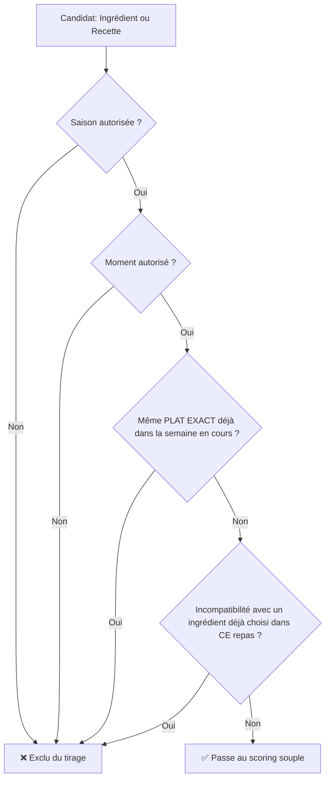
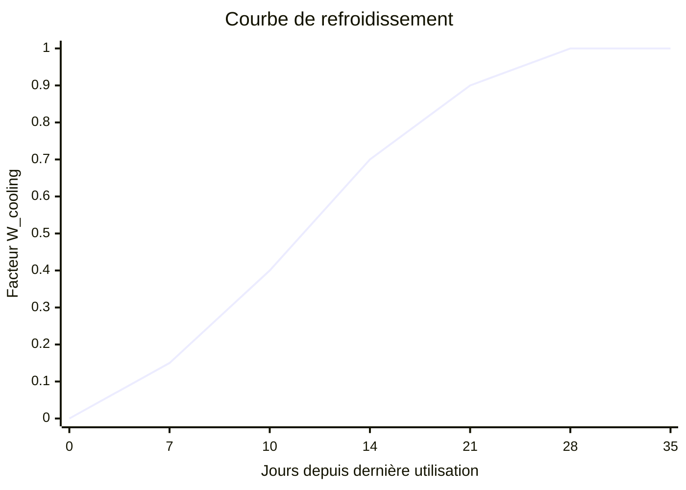
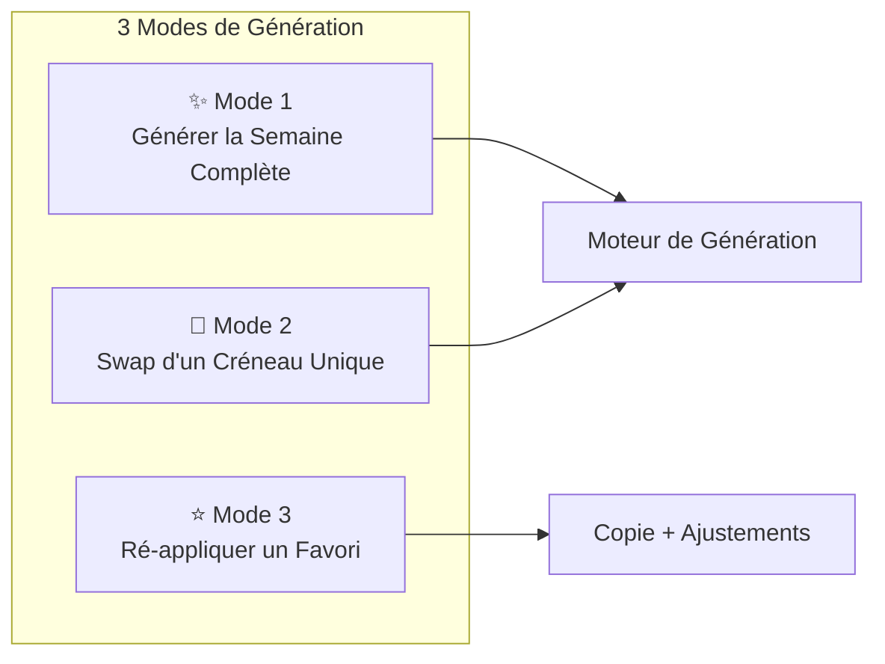
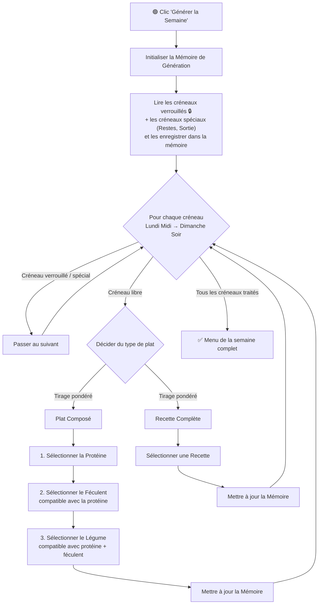
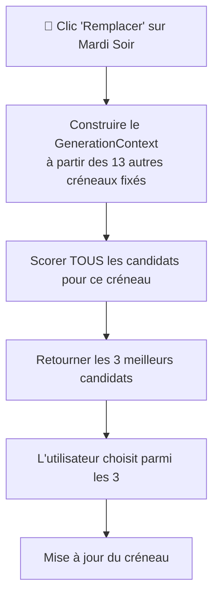
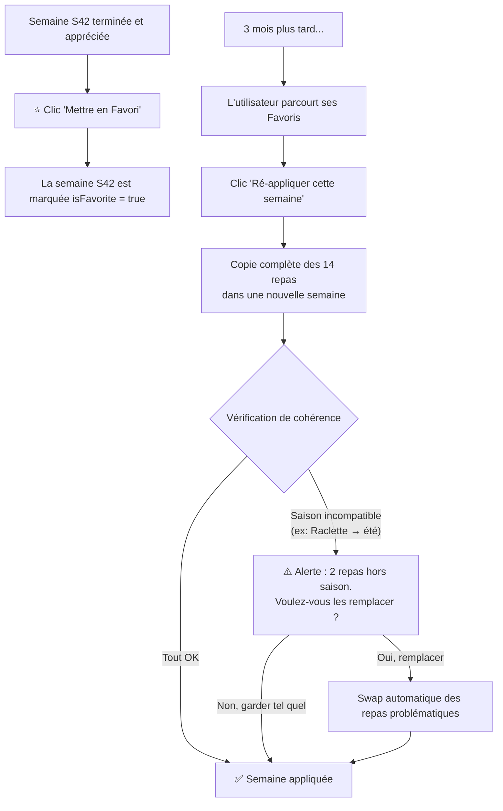
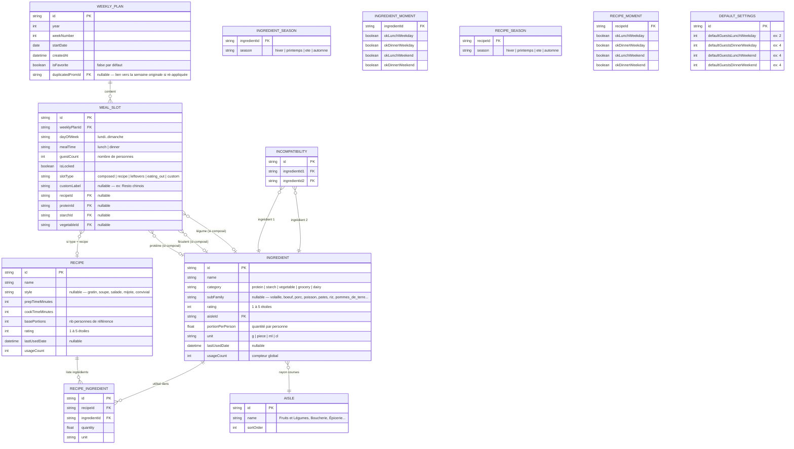
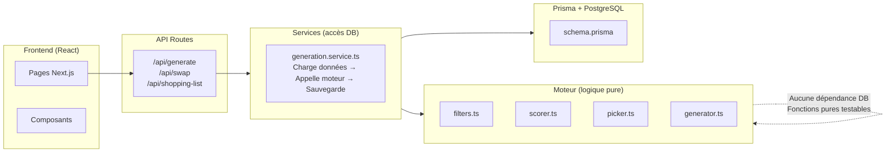

# 📋 Plan Complet & Définitif — MenuD-laSemaine V2

---

## 1. Diagnostic de l'Ancien Système et Problèmes à Résoudre

### Ce qui existait

L'ancien code Java utilise un **score multiplicatif** pour chaque produit :

```
poidsFinal = poidsMoment[moment] × poidsSaison[saison] × poidsArbitraire × poidsLastUsed
```

Avec `poidsMoment` = tableau de 4 entiers `[midiSemaine, soirSemaine, midiWeekend, soirWeekend]`, `poidsSaison` = tableau de 4 entiers `[printemps, été, automne, hiver]`, et une courbe `lastUsed` à seuils (< 4j → 0, > 21j → 10).

### Les problèmes fondamentaux identifiés

| # | Problème | Conséquence |
|---|----------|-------------|
| 1 | **Aucune mémoire intra-semaine pendant la génération** | Le `WeightManager` retire les produits "déjà utilisés dans le menu courant" mais le menu courant est celui de la BDD (la semaine précédente), pas celui en train d'être construit. Résultat : doublons dans la même semaine. |
| 2 | **Assemblage aléatoire brut** (viande + légume + féculent tirés séparément) | Produit des combinaisons incohérentes. L'incompatibilité ne filtre que légume ↔ féculent, pas protéine ↔ accompagnement. |
| 3 | **Saisie de 8 poids numériques par produit** | Lourd à remplir, difficile à ajuster. Quelle différence entre un poids de 30 et un poids de 50 pour `midiSemaine` ? C'est arbitraire et non intuitif. |
| 4 | **Pas d'historique** | Le `Menu` en BDD écrase la semaine précédente (PK = jour + moment). Impossible de consulter ou d'utiliser l'historique. |
| 5 | **Courbe de cooling trop abrupte** | < 4 jours = 0 (exclu), > 21 jours = 10 (plein). Pas de nuance entre "mangé il y a 5 jours" et "mangé il y a 18 jours". |

---

## 2. Système de Pondération Complet

### 2.1. Principes Fondateurs

> **Objectif** : Trouver le juste milieu entre "trop précis" (= répétitif car on converge vers les mêmes optimums) et "trop aléatoire" (= combinaisons absurdes).

La solution : un système en **deux couches** :
1. **Couche dure (Filtres binaires)** : Exclut catégoriquement certains candidats. Réduit le pool.
2. **Couche souple (Scores pondérés)** : Classe les candidats restants par probabilité, puis tire au hasard de façon pondérée.

### 2.2. Couche Dure — Filtres d'Exclusion (oui/non)

Avant même de calculer un score, un candidat est **exclu** si l'un de ces filtres est faux :



> [!IMPORTANT]
> **Clarification sur les doublons :** Le filtre dur bloque uniquement le **plat exact identique** dans la même semaine.
> - Pour une **recette complète** : on bloque la même recette (ex: pas 2× "Poulet curry" dans la semaine).
> - Pour un **plat composé** : on bloque la même combinaison exacte (protéine + féculent + légume). Mais la **même protéine** dans une composition **différente** est autorisée.
>
> **Exemple :** "Poulet + Riz + Haricots verts" le lundi → "Poulet + Pâtes + Courgettes" le jeudi est **autorisé** (ce sont deux plats différents). Le poulet revient, mais dans une préparation distincte. C'est la sous-famille `volaille` qui reçoit un **malus souple** via $W_{\text{variété}}$, pas un blocage dur.

#### Filtre Saison

Chaque ingrédient/recette déclare ses **saisons autorisées** via des tags simples à cocher :

| Saison | Mois couverts |
|--------|---------------|
| `hiver` | Décembre, Janvier, Février |
| `printemps` | Mars, Avril, Mai |
| `ete` | Juin, Juillet, Août |
| `automne` | Septembre, Octobre, Novembre |
| `toutes` | Toujours autorisé |

**Exemples concrets :**

| Aliment / Recette | Saisons autorisées | Effet |
|-------------------|--------------------|-------|
| Raclette | `hiver` | ❌ Exclu en été, printemps, automne |
| Barbecue | `ete`, `printemps` | ❌ Exclu en hiver |
| Salade composée | `ete`, `printemps` | ❌ Exclu en hiver |
| Pâtes | `toutes` | ✅ Jamais exclu par la saison |
| Soupe de potiron | `automne`, `hiver` | ❌ Exclu en été |
| Poulet rôti | `toutes` | ✅ Jamais exclu |

> **Simplification UX** : À la saisie, on coche simplement les saisons. Pas de poids numériques. Un aliment est soit disponible cette saison, soit non.

#### Filtre Moment (Midi/Soir × Semaine/Weekend)

Chaque ingrédient/recette déclare ses **moments autorisés** via 4 booléens :

| Champ | Signification |
|-------|---------------|
| `okMidiSemaine` | Adapté au déjeuner en semaine (rapide, simple) |
| `okSoirSemaine` | Adapté au dîner en semaine (temps moyen) |
| `okMidiWeekend` | Adapté au déjeuner le week-end (plus élaboré) |
| `okSoirWeekend` | Adapté au dîner le week-end (convivial) |

**Exemples concrets :**

| Aliment / Recette | Midi Sem. | Soir Sem. | Midi WE | Soir WE | Logique |
|---|:---:|:---:|:---:|:---:|---|
| Steak haché | ✅ | ✅ | ✅ | ✅ | Rapide, passe partout |
| Bœuf bourguignon | ❌ | ❌ | ✅ | ✅ | Trop long en semaine |
| Raclette | ❌ | ❌ | ❌ | ✅ | Plat de soirée conviviale WE |
| Salade composée | ✅ | ✅ | ✅ | ❌ | Pas un "vrai dîner" du WE |
| Omelette | ✅ | ✅ | ❌ | ❌ | Dépannage semaine seulement |

> **Simplification UX** : 4 cases à cocher. Pas de poids numériques. Par défaut les 4 sont cochées, on décoche ce qui ne convient pas.

### 2.3. Couche Souple — Score Pondéré

Pour tous les candidats qui passent les filtres durs, on calcule un score qui détermine leur **probabilité relative** d'être choisis. Plus le score est haut, plus la probabilité est élevée.

$$\text{Score}(C) = W_{\text{appréciation}} \times W_{\text{cooling}} \times W_{\text{variété}}$$

#### A. Poids d'Appréciation $W_{\text{appréciation}}$

La seule valeur subjective que l'utilisateur doit saisir. **Une note de 1 à 5** représentant combien la famille aime cet aliment/recette.

| Note | Signification | Coefficient |
|:---:|---|:---:|
| ⭐ | On en mange si y'a rien d'autre | 1 |
| ⭐⭐ | Correct, sans plus | 2 |
| ⭐⭐⭐ | On aime bien | 3 |
| ⭐⭐⭐⭐ | On adore | 4 |
| ⭐⭐⭐⭐⭐ | Le plat préféré de la famille | 5 |

> **Remarque importante** : Un plat noté 5 n'a "que" 5× plus de chances qu'un plat noté 1. C'est intentionnellement modéré : ça favorise les favoris sans les imposer à chaque semaine. Si on mettait des poids de 10, 50, 100 comme dans l'ancien système, les plats à poids fort domineraient tout.

#### B. Courbe de Refroidissement $W_{\text{cooling}}$

Basée sur le nombre de jours $\Delta t$ depuis la dernière utilisation de ce **plat exact** (pas l'ingrédient brut). C'est la `lastUsedDate` de la recette, ou la date de dernière utilisation de la combinaison exacte pour un plat composé.

```
W_cooling(Δt) :
  Δt = 0 jours (même semaine) →  0.0  (exclu par le filtre dur intra-semaine)
  Δt = 7-9 jours              →  0.15
  Δt = 10-13 jours             →  0.4
  Δt = 14-20 jours             →  0.7
  Δt = 21-27 jours             →  0.9
  Δt ≥ 28 jours               →  1.0
  Jamais utilisé               →  1.0
```



> Différence avec l'ancien système : la courbe est plus progressive (5 paliers au lieu de 3) et couvre 4 semaines au lieu de 3.

#### C. Pénalité de Variété Intra-Semaine $W_{\text{variété}}$

C'est la **nouveauté majeure**. Pendant la génération de la semaine, le moteur maintient une **mémoire des choix déjà faits** pour les créneaux précédents. Cette mémoire pénalise les répétitions de *catégories similaires* au sein de la même semaine.

Ici on ne parle **pas** de bloquer (c'est le rôle des filtres durs), mais de **rendre moins probable**. Un ingrédient comme le poulet PEUT apparaître deux fois dans la semaine (dans des préparations différentes), mais c'est rendu improbable par le malus de sous-famille.

| Situation détectée | Pénalité $W_{\text{variété}}$ | Exemple |
|---|:---:|---|
| Même **sous-famille de protéine** à ≤ 1 repas d'écart | × 0.05 | Poulet hier soir → Dinde ce midi (volaille 2× de suite) |
| Même **sous-famille de protéine** à 2-3 repas d'écart | × 0.3 | Poulet lundi midi → Poulet (autre recette) mardi soir |
| Même **sous-famille de protéine** à 4+ repas d'écart | × 0.7 | Bœuf lundi → Bœuf jeudi (acceptable, juste un petit malus) |
| Même **type de féculent** à ≤ 1 repas d'écart | × 0.1 | Pâtes hier soir → Pâtes ce midi |
| Même **type de féculent** à 2-3 repas d'écart | × 0.4 | Riz lundi → Riz mercredi |
| Même **style de plat** (gratin, soupe, salade) à ≤ 2 repas d'écart | × 0.2 | Gratin lundi → Gratin mardi |
| Aucune répétition détectée | × 1.0 | — |

**Sous-familles de protéines :**

| Sous-famille | Exemples d'ingrédients |
|---|---|
| `volaille` | Poulet, Dinde, Canard |
| `boeuf` | Steak haché, Entrecôte, Bœuf haché |
| `porc` | Côte de porc, Jambon, Saucisse |
| `poisson` | Saumon, Cabillaud, Thon |
| `oeuf` | Omelette, Œufs durs |
| `vegetarien` | Tofu, Légumineuses |

> Chaque ingrédient de type "protéine" est assigné à une sous-famille. Quand le moteur choisit du Poulet pour le lundi soir, toute la sous-famille `volaille` reçoit un malus pour les repas suivants, **mais n'est pas bloquée**. Il est donc possible (mais improbable) d'avoir du poulet 2× dans la semaine dans des préparations différentes — exactement comme dans la vraie vie.

---

## 3. Modes de Génération & Algorithme

Le système propose **3 modes de génération** distincts :



### 3.1. Mode 1 — Générer la Semaine Complète

L'utilisateur clique sur **"✨ Générer la Semaine"**. Le moteur remplit tous les créneaux non verrouillés d'un coup.



### 3.2. Mode 2 — Swap d'un Créneau Unique

L'utilisateur voit le menu généré mais **un repas ne lui convient pas**. Il clique sur **🔄 Remplacer** sur ce créneau précis.

**Comportement :**
1. Le moteur construit le `GenerationContext` à partir de **tous les autres créneaux déjà fixés** de la semaine (les 13 autres repas).
2. Il exécute la sélection **uniquement pour ce créneau**, en tenant compte du contexte complet.
3. Il propose **3 alternatives** classées par score décroissant.
4. L'utilisateur choisit celle qui lui plaît, ou clique "Autre" pour en voir 3 de plus.



> **Astuce UX** : Si l'utilisateur swap plusieurs repas d'affilée, chaque swap suivant prend en compte les changements précédents (le contexte est recalculé à chaque fois).

### 3.3. Mode 3 — Semaines Favorites & Ré-application

L'utilisateur peut **mettre une semaine en favori ⭐** pour la sauvegarder. Plus tard, il peut choisir de **ré-appliquer cette semaine** à une autre date.

**Fonctionnement :**



**Règles de ré-application :**
- La copie crée un **nouveau** `WeeklyPlan` avec un lien `duplicatedFromId` vers l'original.
- Le système vérifie que chaque repas est **compatible avec la saison actuelle**. Ceux qui ne le sont pas sont signalés à l'utilisateur.
- Le cooling et le `lastUsedDate` sont **ignorés** lors d'une ré-application (c'est un choix délibéré de l'utilisateur, il sait ce qu'il fait).
- L'utilisateur peut ensuite modifier individuellement les repas via le Mode 2 (Swap).

### 3.4. La Mémoire de Génération (GenerationContext)

C'est l'objet clé qui n'existait pas dans l'ancien code. Pendant la génération (Mode 1) ou le swap (Mode 2), cet objet est maintenu et mis à jour :

```typescript
interface GenerationContext {
  // La saison courante (calculée une fois)
  season: 'hiver' | 'printemps' | 'ete' | 'automne';
  
  // Historique des choix DANS la semaine en cours
  // Index 0 = Lundi Midi, 1 = Lundi Soir, ..., 13 = Dimanche Soir
  slots: Array<{
    slotIndex: number;          // 0..13
    dayOfWeek: string;          // 'lundi'..'dimanche'
    mealTime: 'lunch' | 'dinner';
    isWeekend: boolean;
    
    // Ce qui a été assigné (null si pas encore traité)
    assignedType: 'composed' | 'recipe' | 'leftovers' | 'eating_out' | null;
    proteinId?: string;
    proteinFamily?: string;     // 'volaille', 'boeuf', 'porc', 'poisson'...
    starchId?: string;
    vegetableId?: string;
    recipeId?: string;
    recipeStyle?: string;       // 'gratin', 'soupe', 'salade', 'mijoté'...
  }>;

  // Compteurs de sous-familles utilisées dans la semaine
  proteinFamilyCounts: Map<string, number>;  // ex: { volaille: 2, boeuf: 1 }
  starchCounts: Map<string, number>;         // ex: { pates: 1, riz: 2 }
}
```

> **Mode 1** : Le contexte démarre vide (+ les slots verrouillés) et se remplit progressivement.
> **Mode 2** : Le contexte est pré-rempli avec les 13 créneaux déjà fixés, et le moteur génère uniquement le créneau cible.

### 3.5. Algorithme Détaillé de Sélection d'un Ingrédient

Pour chaque slot, voici le pseudocode précis :

```
FONCTION sélectionnerIngredient(
    type: 'protein' | 'starch' | 'vegetable',
    contexte: GenerationContext,
    slotIndex: number,
    protéineChoisie?: Ingredient    // pour filtrer l'incompatibilité
) → Ingredient

    1. RÉCUPÉRER tous les ingrédients de ce type depuis la BDD
    
    2. FILTRES DURS — Exclure :
       a. Saison non autorisée (saison courante ∉ ingredient.seasons)
       b. Moment non autorisé (calculer le moment du slot, vérifier le booléen)
       c. Même COMBINAISON EXACTE déjà assignée dans la semaine en cours
          (pas l'ingrédient seul — le PLAT complet)
       d. Si protéineChoisie fournie : vérifier la table Incompatibilité
       
    3. SCORING SOUPLE — Pour chaque candidat restant :
       a. W_appreciation = ingredient.rating           (1 à 5)
       b. W_cooling = courbeRefroidissement(
              joursDepuis(ingredient.lastUsedDate))     (0.0 à 1.0)
       c. W_variete = calculerPénalitéVariété(
              ingredient, contexte, slotIndex)          (0.05 à 1.0)
       d. score = W_appreciation × W_cooling × W_variete
       
    4. TIRAGE PONDÉRÉ
       - Sommer tous les scores
       - Tirer un nombre aléatoire entre 0 et somme
       - Parcourir les candidats en accumulant les scores
       - Retourner le candidat dont le cumul dépasse le nombre tiré
       
    5. Si aucun candidat (tous exclus) :
       - Relâcher progressivement les filtres (cooling, puis variété)
       - Réessayer le tirage
       - Si toujours aucun : retourner null (le slot sera marqué "à choisir manuellement")
```

### 3.6. Décision Composé vs Recette

Pour chaque créneau, le moteur décide d'abord s'il génère un **plat composé** ou une **recette complète**. Ce n'est pas 50/50 : cela dépend du contexte.

```
ratio = nombre de recettes complètes déjà assignées cette semaine / nombre de slots déjà traités

SI le moment est un week-end :
    probabilité_recette = 0.55   // Plus de chances de recettes élaborées le WE
SINON SI le moment est midi en semaine :
    probabilité_recette = 0.25   // Midi semaine → surtout des plats composés rapides
SINON : // soir semaine
    probabilité_recette = 0.40

// Correction d'équilibrage : éviter trop de recettes ou trop de composés d'affilée
SI ratio > 0.5 :
    probabilité_recette *= 0.5   // On a déjà beaucoup de recettes, favoriser les composés
SI ratio < 0.2 ET slots_traités > 4 :
    probabilité_recette *= 1.5   // Pas assez de recettes, en favoriser
    
tirer au hasard selon probabilité_recette
```

---

## 4. Simplification de la Saisie — UX pour Remplir la BDD

### Ancien système (problématique)

Pour ajouter un produit dans l'ancien code, il fallait fournir **11 valeurs numériques** :

```sql
CALL ajouter_produit('Harricot-vert', 'Legume', 50, 30, 100, 50, 100, 80, 100, 80, 50);
--                     nom            type      arb  mS   sS   mW   sW  pri  été  aut  hiv
```

→ Impossible de savoir intuitivement quoi mettre comme valeurs.

### Nouveau système (simplifié)

Pour ajouter un ingrédient, il faut remplir un formulaire intuitif :

| Champ | Type de saisie | Exemple : "Haricots verts" |
|---|---|---|
| **Nom** | Texte | `Haricots verts` |
| **Catégorie** | Sélecteur | `legume` |
| **Sous-famille** | Sélecteur (si protéine) | — (pas applicable) |
| **Appréciation** | ⭐⭐⭐⭐⭐ (1-5) | ⭐⭐⭐ |
| **Saisons** | Cases à cocher | ☑ Printemps ☑ Été ☑ Automne ☐ Hiver |
| **Moments** | Cases à cocher | ☑ Midi Sem. ☑ Soir Sem. ☑ Midi WE ☑ Soir WE |
| **Quantité/personne** | Nombre + unité | `120 g` |
| **Rayon courses** | Sélecteur | `Fruits & Légumes` |

**Autre exemple — "Raclette" (recette complète) :**

| Champ | Saisie |
|---|---|
| **Nom** | `Raclette` |
| **Type** | `Recette complète` |
| **Style** | `convivial` |
| **Appréciation** | ⭐⭐⭐⭐⭐ |
| **Saisons** | ☐ Printemps ☐ Été ☑ Automne ☑ Hiver |
| **Moments** | ☐ Midi Sem. ☐ Soir Sem. ☐ Midi WE ☑ Soir WE |
| **Temps préparation** | `15 min` |
| **Portions de référence** | `4 personnes` |
| **Ingrédients** | Fromage à raclette: 200g/pers, Pommes de terre: 300g/pers, Charcuterie: 150g/pers, Cornichons: 50g/pers, Salade verte: 50g/pers |

---

## 5. Modèle de Données Complet



---

## 6. Architecture du Code

### Stack technique

| Composant | Technologie | Justification |
|---|---|---|
| **Framework Fullstack** | Next.js 15 (App Router) | Frontend React + API routes dans le même projet. Typage partagé. |
| **Langage** | TypeScript | Typage strict, très proche de Java en syntaxe, erreurs détectées à la compilation. |
| **ORM / Base de données** | Prisma ORM + PostgreSQL | Client typé auto-généré. Migrations versionnées. Swap possible vers SQLite sans changer le code. |
| **Styling** | CSS Vanilla (ou Tailwind si demandé) | Contrôle total du design. |
| **Déploiement** | Docker → Coolify | Dockerfile multi-stage Node Alpine (~120 Mo). |

### Structure des fichiers

```
menudlasemaine/
├── prisma/
│   ├── schema.prisma            # Schéma de la BDD (source de vérité)
│   ├── migrations/              # Migrations auto-générées par Prisma
│   └── seed.ts                  # Données initiales (rayons, quelques ingrédients de démo)
│
├── src/
│   ├── app/                     # Next.js App Router (pages + API)
│   │   ├── layout.tsx           # Layout principal (nav, thème)
│   │   ├── page.tsx             # Page d'accueil → Vue Semaine
│   │   ├── recipes/
│   │   │   └── page.tsx         # CRUD Recettes
│   │   ├── ingredients/
│   │   │   └── page.tsx         # CRUD Ingrédients
│   │   ├── history/
│   │   │   └── page.tsx         # Historique des semaines
│   │   ├── settings/
│   │   │   └── page.tsx         # Préférences (nb personnes par défaut, etc.)
│   │   └── api/
│   │       ├── generate/        # POST: générer une semaine
│   │       ├── swap/            # POST: remplacer un créneau
│   │       ├── shopping-list/   # GET: liste de courses
│   │       └── calendar/        # GET: flux iCal .ics
│   │
│   ├── engine/                  # ★ Moteur de génération (logique pure, AUCUN accès DB)
│   │   ├── types.ts             # Types du moteur (GenerationContext, ScoredCandidate...)
│   │   ├── filters.ts           # Filtres durs (saison, moment, cooling dur, incompatibilité)
│   │   ├── scorer.ts            # Calcul du score souple (appréciation × cooling × variété)
│   │   ├── picker.ts            # Tirage aléatoire pondéré
│   │   ├── generator.ts         # Orchestrateur : boucle sur les 14 slots
│   │   └── cooling.ts           # Courbe de refroidissement (fonction pure)
│   │
│   ├── services/                # Couche service (accès DB via Prisma, appelle le moteur)
│   │   ├── ingredient.service.ts
│   │   ├── recipe.service.ts
│   │   ├── weekly-plan.service.ts
│   │   ├── generation.service.ts  # Charge les données, appelle engine/generator, sauvegarde
│   │   └── shopping-list.service.ts
│   │
│   ├── components/              # Composants React réutilisables
│   │   ├── WeekGrid/            # Grille de la semaine (14 cases)
│   │   ├── MealCard/            # Carte d'un repas (avec actions lock/swap/edit)
│   │   ├── IngredientForm/      # Formulaire d'ajout d'ingrédient
│   │   ├── RecipeForm/          # Formulaire d'ajout de recette
│   │   └── ShoppingList/        # Affichage liste de courses par rayon
│   │
│   └── lib/
│       ├── prisma.ts            # Instance Prisma singleton
│       └── season.ts            # Utilitaire : mois → saison
│
├── Dockerfile                   # Multi-stage build pour Coolify
├── docker-compose.yml           # Dev local (app + PostgreSQL)
├── package.json
└── tsconfig.json
```

### Séparation des responsabilités



> **Point clé** : Le dossier `engine/` ne dépend de **rien** (pas de Prisma, pas de Next.js). Il prend des tableaux d'objets typés en entrée et retourne des résultats. Cela le rend **100% testable unitairement** sans base de données.

---

## 7. Phases d'Implémentation

### Phase 1 — Socle technique & Moteur de génération
- Initialiser le projet Next.js + Prisma + PostgreSQL (Docker Compose pour le dev).
- Écrire le `schema.prisma` complet et lancer les migrations.
- Implémenter le moteur (`engine/`) avec des **tests unitaires** pour valider :
  - Les filtres durs (saison, moment, doublon de plat exact).
  - La courbe de cooling.
  - La pénalité de variété intra-semaine.
  - L'absence de doublons de plat exact sur 100 générations.
  - La possibilité (rare) d'avoir la même protéine dans 2 plats différents.
- Script `seed.ts` avec ~30 ingrédients et ~15 recettes de départ.

### Phase 2 — Interface Utilisateur : Vue Semaine & 3 Modes de Génération
- Grille de la semaine interactive (14 cases).
- **Mode 1** : Bouton "✨ Générer la Semaine" → génère tous les créneaux libres.
- **Mode 2** : Bouton "🔄 Remplacer" par créneau → propose 3 alternatives intelligentes.
- Actions par créneau : Verrouiller 🔒 / Restes / Sortie / Choix manuel.
- Historique : navigation par semaines (calendrier).

### Phase 3 — Gestion des Ingrédients, Recettes & Favoris
- Pages CRUD pour les ingrédients (formulaire simplifié : étoiles + cases à cocher).
- Pages CRUD pour les recettes (avec liste d'ingrédients et quantités).
- Gestion des incompatibilités.
- **Mode 3** : Système de semaines favorites ⭐ avec ré-application et vérification de cohérence saisonnière.

### Phase 4 — Liste de Courses & Déploiement
- Génération de la liste de courses agrégée par rayon.
- Ajustement dynamique par nombre de personnes.
- Dockerfile multi-stage + docker-compose.yml pour Coolify.
- Flux calendrier iCal.

---

## 8. Vérification & Tests

### Tests unitaires (moteur)
```bash
# Vérifier qu'aucun plat EXACT identique n'apparaît 2× dans la même semaine
# Vérifier que la même protéine PEUT apparaître dans 2 combinaisons différentes (mais rarement)
# Vérifier que les filtres saison/moment excluent correctement
# Vérifier que la courbe de cooling fonctionne sur des cas limites
# Vérifier que les incompatibilités sont respectées
# Vérifier que le Mode 2 (Swap) propose des alternatives cohérentes avec le contexte
npm run test
```

### Tests d'intégration
- Seed la BDD avec des données réalistes.
- Générer 50 semaines consécutives et vérifier :
  - Aucun plat exact en doublon dans la même semaine.
  - Aucune recette exacte à moins de 7 jours d'intervalle.
  - Distribution globale des sous-familles de protéines (pas plus de 40% d'une sous-famille sur 50 semaines).
- Tester la ré-application de favoris :
  - Ré-appliquer une semaine d'hiver en été → vérifier que les plats hors saison sont signalés.
  - Ré-appliquer une semaine normale → vérifier que la copie est fidèle.

### Validation manuelle
- Déployer sur Coolify.
- Générer des semaines et vérifier visuellement que les menus "ont du sens".
- Tester le workflow complet : Générer → Swap 2 repas → Valider → Mettre en favori → Ré-appliquer 3 semaines plus tard.
