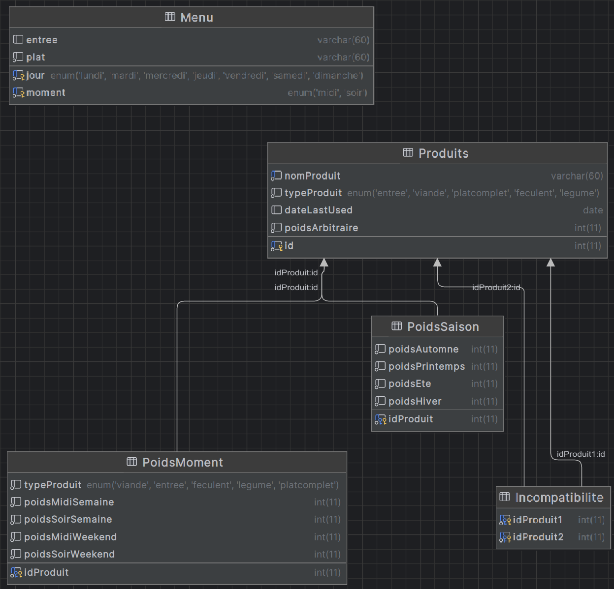

# La base de données.

### Tables
#### - 

### Views
- Une vue qui permet de voir tous les produits.

### Routines
- Une routine qui permet d'ajouter un produit.
- Une routine qui permet de modifier un produit.
- Une routine qui permet de supprimer un produit.

### Class
#### DAO (Data Access Object)
- Une DAO pour les produits : Elle contient la liste de tous les produits de la table `produit` (etant donnée qu'elle n'est pas tres lourde c'est le plus rapide) et si la liste est modifier de quelque maniere que se soit étant donnée que l'on doit passer par la DAO pour modifier quoi que se soit a se moment la on a un dirty bit qui permet de savoir si on doit mettre a jour par rapport a la bd ou non au prochaine demande su la liste.
- Une DAO pour le menu : Meme system pour des soucis de performance on aura une version local du menu et on mettra a jour la bd seulement si on a un dirty bit.
- Une DAO pour les incompatibilités.

#### Utils

- Une classe qui permet de se connecter a la base de données. (Crée une pool de connexion pour plus de performance)

### Tests
- A venir ...