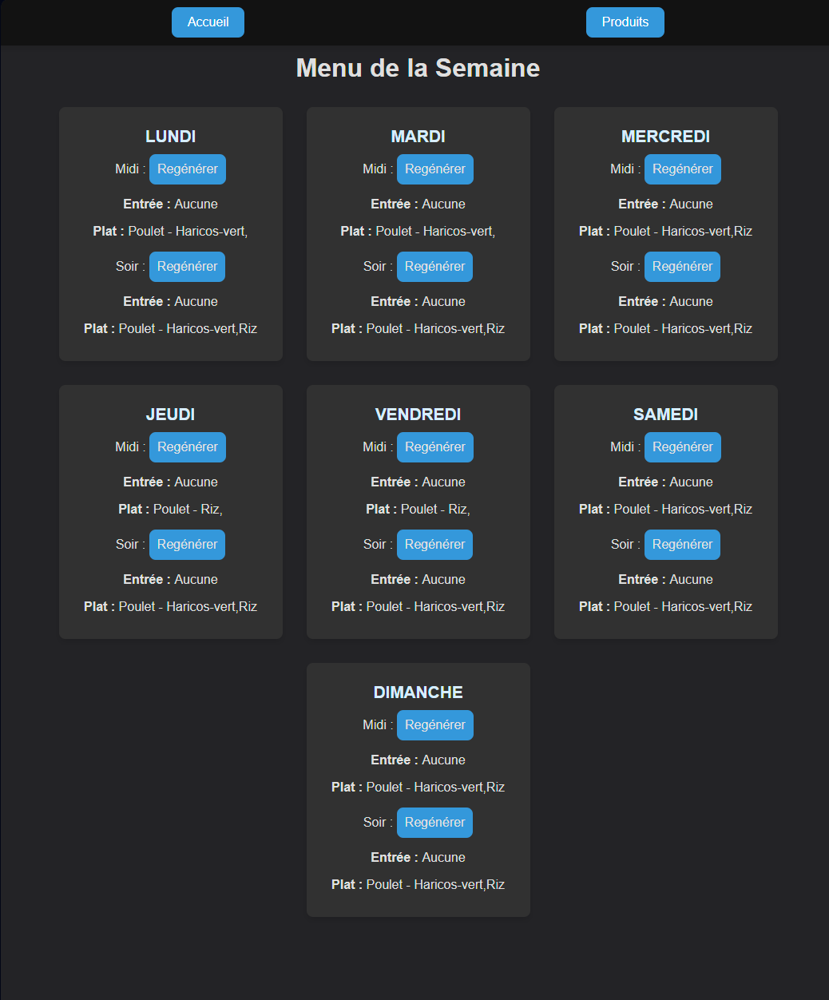
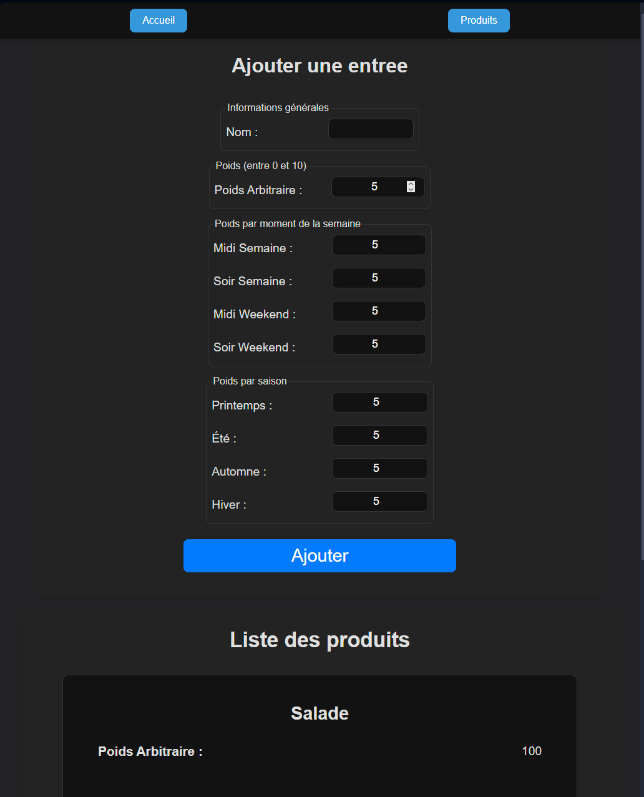
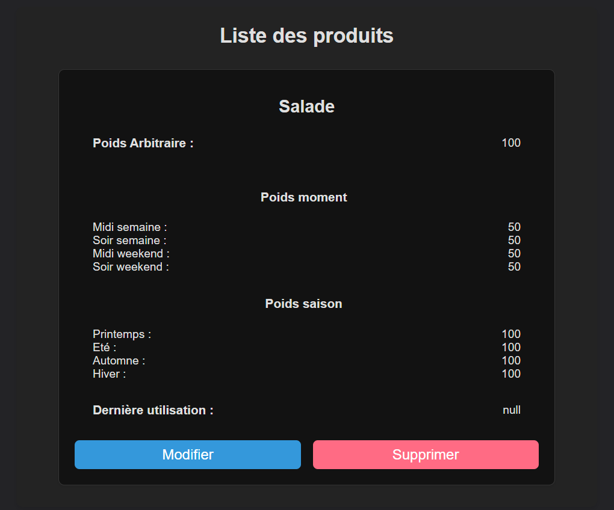

# Interface web

## Introduction
Pour pouvoir utiliser les fonctionnalités de l'API, il est nécessaire de passer par une interface web. Cette interface permet de visualiser les données de l'API, de les modifier et de les supprimer. Elle permet également de créer de nouvelles données.

L'interface web est héberger sur mon serveur par NGINX.

Elle est codée majoritairement en JavaScript, HTML et CSS.
Elle est mobile first.

## Utilisation
- La page index permet de voir le menu de la semaine.

  
- La page produits permet de voir les produits disponibles, en ajouter, en modifier ou en supprimer.

  
  